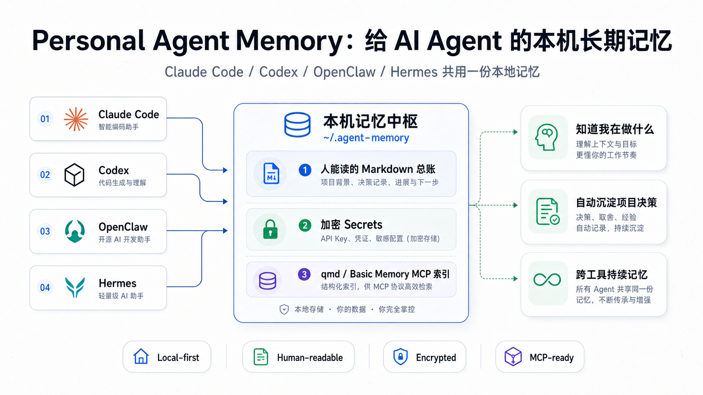

# Personal Agent Memory

**A tiny local memory assistant for coding agents.**



Personal Agent Memory gives Claude Code, Codex, OpenClaw, Hermes, and other agent tools a shared local memory without sending your private project history to a cloud service.

It has two layers:

- **Runtime layer:** CLI, MCP server, hooks, readable Markdown, and encrypted secret storage.
- **Skill layer:** a portable agent instruction pack that teaches agents when to remember and how to call the runtime.

Install the CLI:

```bash
npm install -g personal-agent-memory
agent-memory init
```

Install the agent skill:

```bash
npx skills add wenhanweime/personal-agent-memory --skill personal-agent-memory -g --agent '*'
```

The CLI stores memory. The skill teaches your agent when to save, recall, redact, and search it.

It is deliberately simple:

- human-readable Markdown for the things you want to inspect
- encrypted storage for complete secrets
- hooks for automatic session-end capture
- MCP tools for agent recall/save/search
- one local folder you control

Think of it as a personal project ledger for AI agents.

## How It Works

Personal Agent Memory turns scattered agent chats into one local memory layer:

- your agents save durable facts through hooks, CLI commands, or MCP tools
- readable notes land in `~/.agent-memory/human`
- secrets are redacted from Markdown and encrypted separately
- search indexes and Basic Memory can sit on top of the readable ledger
- every agent can start from the same local context instead of a blank session

The result is simple: Claude Code, Codex, OpenClaw, Hermes, and future tools can all remember the same project decisions, workflows, and preferences while you keep ownership of the files.

## Why

Agent memory tools are often powerful but heavy: cloud accounts, vector databases, knowledge graphs, dashboards, and hidden state. That is useful for some teams, but many developers need something smaller:

> "What am I doing on this computer, across all my agent sessions, projects, APIs, decisions, and workflows?"

Personal Agent Memory starts with that question.

## What It Stores

```text
~/.agent-memory/
  human/
    00-now.md
    01-projects.md
    02-decisions.md
    03-workflows.md
    04-credentials-redacted.md
  private/
    secrets.md.enc
  events/
  qmd-index/
  AGENTS.md
```

The `human/` folder is meant to be opened and read. The `private/` folder is not.

## Install

From npm:

```bash
npm install -g personal-agent-memory
agent-memory init
```

From GitHub:

```bash
git clone https://github.com/wenhanweime/personal-agent-memory.git
cd personal-agent-memory
npm install
npm link
agent-memory init
```

## Install As A Skill

Personal Agent Memory also ships as an agent skill. Use it when you want Codex, Claude Code, OpenClaw, Hermes, or another skill-aware agent to understand the memory protocol automatically:

```bash
npx skills add wenhanweime/personal-agent-memory --skill personal-agent-memory -g --agent '*'
```

The skill is intentionally thin:

- it tells agents when to save durable facts
- it tells agents when to recall existing context
- it routes writes through `agent-memory save`
- it keeps full secrets out of readable Markdown
- it explains the MCP and Basic Memory integration

The real storage still lives in the local CLI/MCP system.

## Install With Basic Memory

If you already use Basic Memory, point it at the readable ledger:

```bash
uv tool install basic-memory
basic-memory project add agent-memory ~/.agent-memory/human --local --default
basic-memory reindex --project agent-memory
```

Then expose Basic Memory to your agent:

```bash
claude mcp add basic-memory basic-memory mcp
```

For Codex:

```toml
[mcp_servers.basic-memory]
command = "basic-memory"
args = ["mcp"]
```

Personal Agent Memory and Basic Memory are complementary:

- Personal Agent Memory captures, redacts, encrypts, and writes the ledger.
- Basic Memory gives agents a polished local Markdown MCP memory interface.

## Use

Save a durable fact:

```bash
agent-memory save "Default API base URL for demo is https://api.example.com/v1" --project demo
```

Search local memory:

```bash
agent-memory search "default API"
```

Run MCP:

```bash
agent-memory mcp
```

## MCP Tools

- `memory_status`
- `memory_save`
- `memory_search`

These tools let an agent recall and save local memory during a session.

## Claude Code / Codex / OpenClaw

Use the same command from hooks:

```bash
agent-memory save "User prefers concise code-review findings first." --project current-project
```

For MCP clients, point the Personal Agent Memory server command to:

```bash
agent-memory mcp
```

Or use Basic Memory MCP over `~/.agent-memory/human`.

## Secret Handling

If a saved note contains a token-like value, the readable Markdown receives a redacted version:

```text
[SECRET:abc123]
```

The complete value goes into:

```text
~/.agent-memory/private/secrets.md.enc
```

On macOS the encryption passphrase is stored in Keychain. On other systems, set:

```bash
export AGENT_MEMORY_SECRET='a long random passphrase'
```

## How This Relates To Basic Memory

Basic Memory is excellent for local Markdown + MCP knowledge work. Personal Agent Memory is intentionally narrower: it focuses on a private, local, readable project ledger with encrypted secret handling and agent hooks.

They can be used together:

- Personal Agent Memory creates the clean `human/*.md` ledger.
- Basic Memory can index or manage those readable notes.

## Roadmap

- Claude Code hook installer
- Codex hook installer
- OpenClaw/Hermes integration templates
- Basic Memory bridge
- transcript importers
- richer project dashboard generation

## License

MIT
